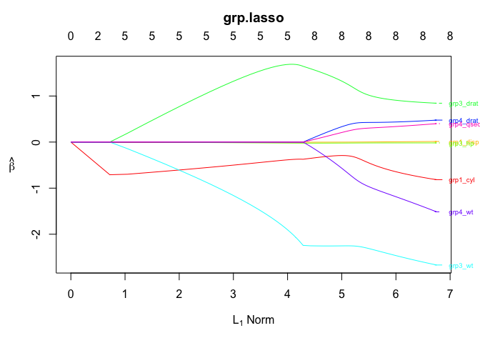
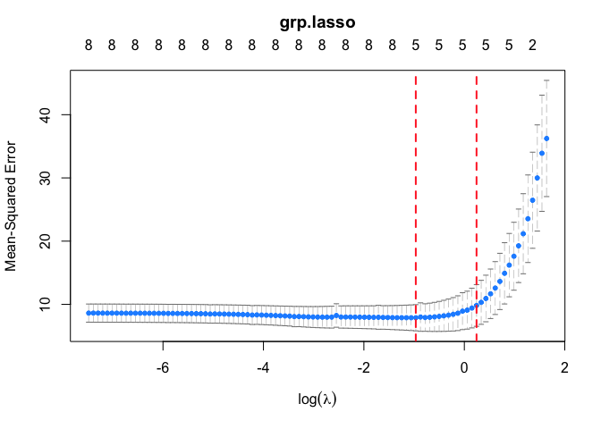

## Introduction

**ovganet** is an R package that fits overlapping group elastic nets using the latent group lasso approach [(Obozinski et al., 2011)](https://arxiv.org/abs/1110.0413). Our package is an extension of the [oem](https://github.com/jaredhuling/oem) package developed by [Huling, J.D. and Chien, P.](https://arxiv.org/abs/1801.09661), based on [Xiong, S. et al., 2016](https://www.tandfonline.com/doi/full/10.1080/00401706.2015.1054436). Certain parts of our code are adapted from [grpregOverlap](https://github.com/YaohuiZeng/grpregOverlap).

Author(s): Haosen He, Alison Morantz

## Installation

You can use the `devtools` package to install **ovganet**. If you don't have `devtools` installed, you can install it by running the following code:

```
install.packages("devtools", repos = "http://cran.us.r-project.org")
```

Then go ahead and install **ovganet** from GitHub:

```
library(devtools)

devtools::install_github("HaosenHe/ovganet")
```

### Get Started

Let's first import the package:

```
library(ovganet)
```

And a test data set:

```
data(mtcars)
```

Convert the data set to desired formats:

```         
X <- as.matrix(mtcars[,-1])
y <- as.vector(mtcars$mpg)
```

Define an overlapping group (numbers represent column numbers in X)

```         
group = list(c(1,2), c(2,3), c(3,4,5),c(4,5,6))
```

Perform overlapping group lasso:

```         
fit <- ovganet(X = X, y = y, group = group, family ='gaussian')
```

Plot the path plot:

```         
plot(fit)
```

 

Fit a cross-validated model:

```         
cvfit <- cv.ovganet(X = X, y = y, group = group, family ='gaussian')
```

Plot CV plot:

```         
plot(cvfit)
```


